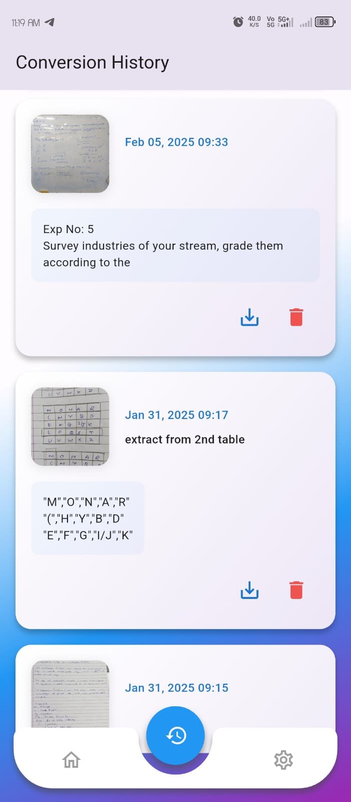
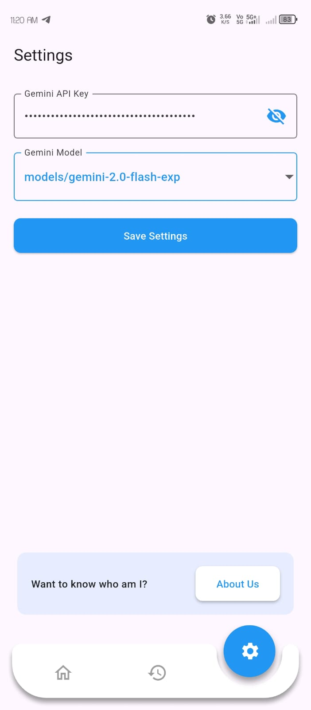
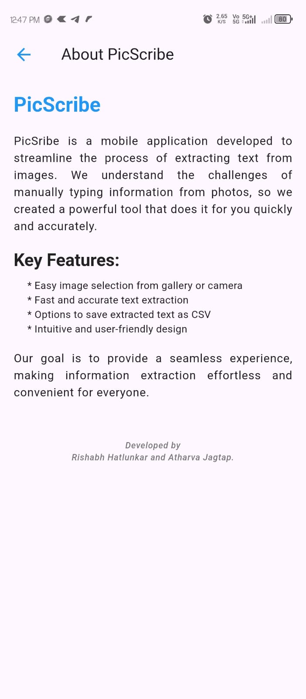

# 📸 PicScribe

**PicScribe** is a powerful **Flutter-based** application that converts images into structured text or tables (CSV) using **Google Gemini AI**. The software enhances user prompts dynamically through **prompt scripting** and provides intelligent image-to-text extraction.

---

## 🚀 Features

- 🔑 **Secure API Integration** – Accepts **Google Gemini API Key** at startup.
- 🖼️ **Image Processing** – Upload images and extract information using AI.
- 📝 **Dynamic Prompt Scripting** – Enhances user prompts via `prompt.jinja2`.
- 📊 **Multiple Output Formats** – Get structured text or **CSV tables**.
- ⚡ **Flutter-Powered UI** – Fast, responsive, and cross-platform.

---

## 🛠️ Installation

### 1️⃣ Clone the Repository
```
git clone https://github.com/yourusername/PicScribe.git
cd PicScribe
```

### 2️⃣ Install Dependencies
```
flutter pub get
```

### 3️⃣ Run the App
```
flutter run
```

### For gradle build errors (due to Flutter update)
```
(delete android folder) 
flutter create .
```

---

## 🎯 How It Works

1️⃣ **Enter Gemini API Key** – The user provides their Google Gemini API key at startup.  
2️⃣ **Upload an Image** – Select an image from your device.  
3️⃣ **Specify a Prompt** – Define what information to extract from the image.  
4️⃣ **Prompt Enhancement** – The app refines the prompt using `prompt.jinja2`.  
5️⃣ **AI Processing** – The enhanced prompt and image are sent to Gemini AI.  
6️⃣ **Results** – The output is displayed as structured text or exported as a CSV file.  

---

## How It Looks Like 

<div align='left'>
  
  
  
  
</div>

---

## 📁 Project Structure

```
PicScribe/
│── lib/                  # Main application code
│   ├── main.dart         # App entry point
|   ├── providers/        # State management
|   ├── templates/        # Com=ntains prompt.jinja2 file 
|   ├── widgets/          # Contains re-usable widgets 
│   ├── screens/          # UI screens
│   ├── services/         # API and processing logic
│   ├── models/            # Utility functions
│── assets/               # Images and other assets
│── prompt.jinja2         # Prompt enhancement template
│── pubspec.yaml          # Dependencies and configurations
│── README.md             # Project documentation
```

---

## 🏗️ Technologies Used

- **Flutter** – Frontend framework
- **Dart** – Programming language
- **Google Gemini API** – AI processing
- **Jinja2** – Prompt enhancement
- **CSV Processing** – Table generation

---
## Release apk 


## 📌 Future Enhancements

- 📍 **Multi-language Support**
- 📤 **Cloud Storage Integration**
- 🔍 **Advanced Image Processing**

---

## 🤝 Contributing

1. Fork the repo.
2. Create a new branch: ***git checkout -b feature-xyz***
3. Commit changes: ***git commit -m "Added new feature"***
4. Push to the branch: ***git push origin feature-xyz***
5. Open a pull request.

---

## 📜 License

This project is licensed under the **MIT License**.

---

## 📞 Contact

📧 Email: [rishabhhatlunkar305@gmail.com](mailto:rishabhhatlunkar305@gmail.com)  

---

⭐ **If you like this project, don't forget to star it!** ⭐
